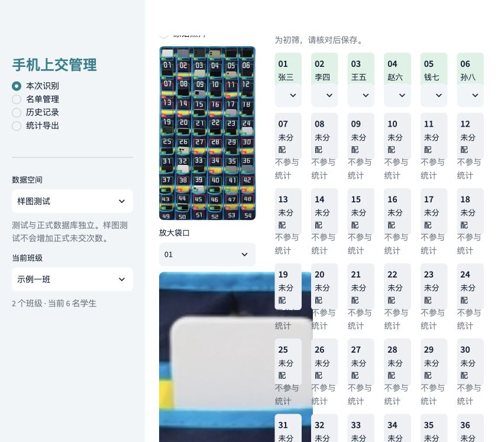
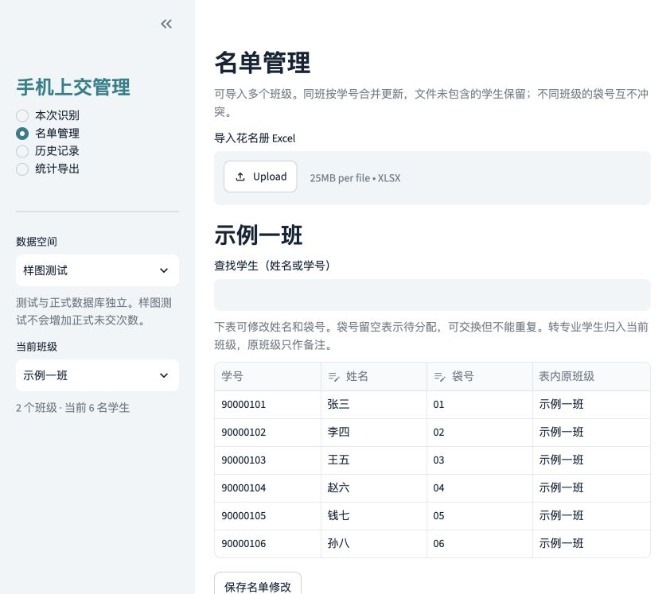
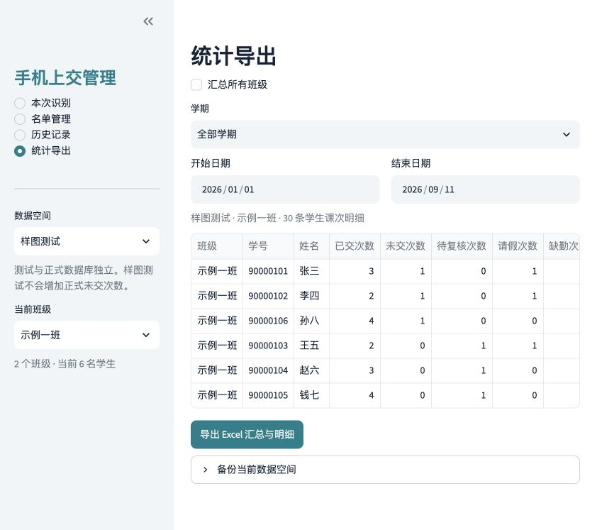
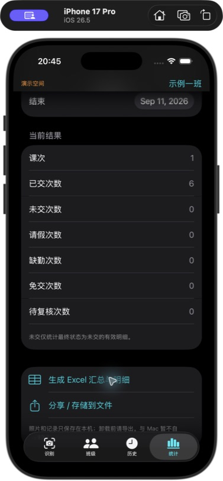

<div align="center">
  
  <h1>Phone Pocket Manager</h1>
  <p><strong>手机上交管理 · 从一张照片，到一份学期统计</strong></p>
  <p>本地识别 · 人工复核 · 多班管理 · Excel 导出</p>
  <p>
    <a href="https://github.com/ryujou/phone-pocket-manager/actions/workflows/tests.yml"></a>
    <a href="LICENSE"></a>
    
    
  </p>
  <p>
    <a href="#-实际效果">实际效果</a> ·
    <a href="#-快速开始">快速开始</a> ·
    <a href="docs/getting-started.md">使用文档</a> ·
    <a href="https://github.com/ryujou/phone-pocket-manager/issues">反馈问题</a>
  </p>
</div>

---

把手机袋照片交给 OpenCV 初筛，在界面上核对袋号和姓名，再保存为本次课的上交记录。期末按班级、学期和日期导出统计，历史更正会同步反映到汇总结果中。

**支持桌面网页、macOS 应用窗口、原生 Android 和 iOS。** 首次准备依赖后，日常识别与记录管理都在本地完成。

## 📸 实际效果

以下为**应用实际运行截图**，使用虚构名单与演示记录；识别输入为 [AI 修改示例照片](docs/images/example-ai-edited.jpg)。界面截图未经 AI 生成或重绘。

### 识别与人工复核

左侧查看袋位编号与初筛标注，右侧核对学生姓名、修改状态。未分配袋位自动排除在学生统计之外。



<table>
  <tr>
    <th width="50%">多班名单管理</th>
    <th width="50%">学期统计与导出</th>
  </tr>
  <tr>
    <td></td>
    <td></td>
  </tr>
  <tr>
    <td>导入 XLSX，按班管理学生，调整姓名与袋号。</td>
    <td>按学期和日期筛选，一次导出汇总与明细。</td>
  </tr>
</table>

<sub>截图展示桌面版。统计中的次数为虚构演示数据；Android 拍照流程仍需真机验证。</sub>

### iOS 原生应用

基于 Mac 版流程实现的 SwiftUI 版本，支持拍照、相册、逐袋核对、Excel 名单和学期统计。最低 iOS 26，使用 Xcode 26 打开 [iOS 工程](ios/PhonePocketManager.xcodeproj)。安装到 iPhone 需要配置自己的签名账号。



模拟器流程已验证；真机拍照尚待验证。详见 [iOS 使用与构建说明](ios/README.md)。

## ✨ 能做什么

| 功能 | 说明 |
| :--- | :--- |
| 📷 照片初筛 | OpenCV 分析袋口，按 9 × 6 布局生成 54 个袋位；Android 可调用系统相机 |
| 🎯 人工校正 | 调整四角和网格，放大袋口，逐人修正识别结果 |
| 👥 多班管理 | Excel 导入、学号映射、袋号分配与冲突检查 |
| ✅ 课次登记 | 已交、未交、请假、缺勤、免交、待复核；重复保存更新同一课次 |
| 🕘 历史可改 | 保留当次姓名与袋号快照，修改历史记录后重新汇总 |
| 📊 Excel 导出 | 班级、学期、日期筛选；汇总与逐次明细一起导出 |
| 🔒 本地保存 | 本地存储，演示与正式记录分离，不使用云端识别服务 |

## 🚀 快速开始

### 桌面版

准备 **Python 3.12**，在终端运行：

```sh
git clone https://github.com/ryujou/phone-pocket-manager.git
cd phone-pocket-manager
./desktop/start.sh
```

打开终端显示的本地地址，选择 **样图测试 → AI修改示例图** 即可体验。首次启动会安装依赖，服务默认仅监听 `127.0.0.1`。

<details>
<summary><strong>🍎 macOS：双击打开应用窗口</strong></summary>

先运行桌面版完成 Python 环境准备，安装 Xcode Command Line Tools，然后执行：

```sh
./desktop/macos/build.command
```

双击仓库根目录的 `Phone Pocket Manager.app`。请保持 `.app` 与 `desktop/` 相邻；窗口外壳依赖本地 Python 环境和源码。此构建使用临时签名，未做 Apple 公证。

</details>

<details>
<summary><strong>🤖 Android：构建可拍照的 APK</strong></summary>

Android 1.1 采用 **Google Material 3**：四栏底部导航、圆角卡片、统一表单与弹窗，支持系统深色模式和 Android 12+ 动态配色。拍照、名单、历史与统计均在应用内完成。查看 [界面说明](android/UI.md) · [更新记录](android/CHANGELOG.md)。

需要 **JDK 17、Android SDK 36、Build Tools 36.0.0**。配置 `ANDROID_HOME` 或 `android/local.properties` 后运行：

```sh
cd android
./gradlew testDebugUnitTest assembleDebug
```

安装 `app/build/outputs/apk/debug/app-debug.apk`。应用 ID 为 `org.phonepocketmanager.app`，支持 Android 8.0 及以上。正式发行请自行配置签名。

</details>

> 各平台数据独立保存，暂不自动同步。详细安装、数据备份和统计规则见 [使用文档](docs/getting-started.md)。

## 📋 导入自己的班级

下载 [Excel 示例模板](desktop/samples/roster.xlsx)，按下列结构整理名单：

| 学号/工号 | 姓名 | 班级 | 袋号 |
| :--- | :--- | :--- | :--- |
| 90000101 | 张三 | 示例一班 | 01 |
| 90000102 | 李四 | 示例一班 | 02 |

学号按文本保存，尾号作为默认袋号；同班袋号冲突时需手动调整。多班可分别导入，转班学生请核对当前班级。仓库仅提供 **2 个虚构班级、每班 6 人**，不包含真实学生资料。

## 🧩 技术与边界

| 桌面 / macOS | Android | 存储与交换 |
| :--- | :--- | :--- |
| Python · Streamlit · OpenCV | Kotlin · OpenCV · 系统相机 | SQLite / iOS 本地 JSON · XLSX |
| macOS 使用 Swift / WKWebView 窗口 | 设备本地运行 | 无云端同步 |

识别规则面向**蓝色边框、黄色背景、9 行 × 6 列**手机袋。反光、遮挡、袋体变形或手机完全藏入袋中都可能造成误判，结果应由教师复核。待复核不计为确认未交。

本项目没有训练 YOLO；合成测试图与 AI 示例图不代表现场识别准确率，**不承诺达到 85%**。验证范围见 [测试说明](docs/validation.md)。

<details>
<summary><strong>开发、测试与目录结构</strong></summary>

```text
phone-pocket-manager/
├── desktop/       # 页面、识别、存储、macOS 窗口
├── android/       # 原生 Android 工程
├── ios/           # SwiftUI iPhone / iPad 工程
├── docs/          # 使用文档与实际截图
└── tools/         # 虚构数据生成与公开文件检查
```

```sh
python -m pip install -r desktop/requirements.txt pytest
python tools/audit_public.py
pytest desktop/tests -q
```

`sample_1.jpg` 至 `sample_7.jpg` 是程序绘制的几何夹具，不是独立实拍验证集。可运行 `python tools/generate_mock_data.py` 重建虚构名单与这些夹具，不会覆盖 AI 示例图。

</details>

## 🤝 参与与许可

欢迎通过 [Issue](https://github.com/ryujou/phone-pocket-manager/issues) 反馈问题或提交 PR。请用虚构数据复现，参阅 [贡献指南](CONTRIBUTING.md) 与 [安全说明](SECURITY.md)。**不要上传真实名单、现场照片、数据库、统计报表或签名密钥。**

以 [Apache License 2.0](LICENSE) 开源，第三方声明见 [NOTICE](NOTICE)。

<div align="center">
  <sub>让每次核对更轻松，让每条记录可追溯。</sub>
</div>
