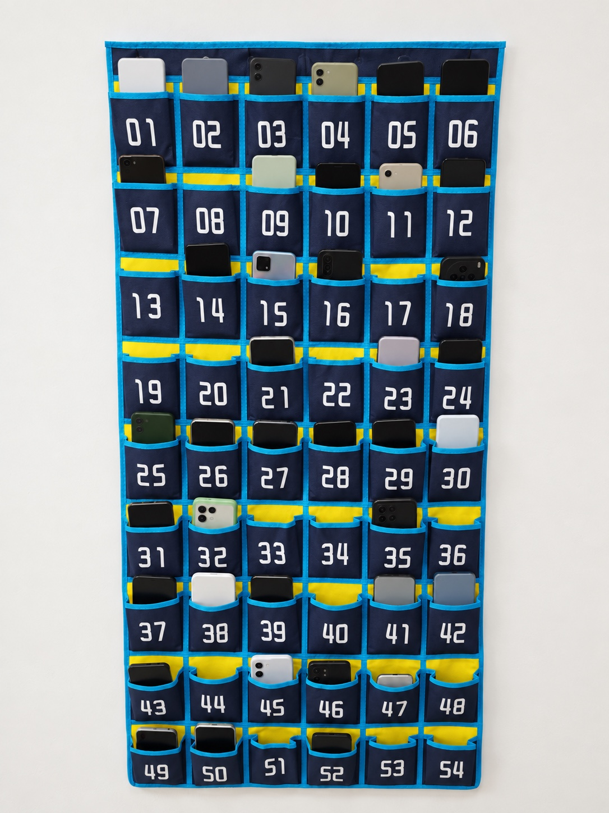

# Phone Pocket Manager · 手机上交管理

本地运行的手机袋管理工具：拍照或上传图片 → OpenCV 初筛 → 按袋号匹配学生 → 人工复核 → 保存课次 → 导出 Excel 统计。

提供 Python 桌面网页、macOS 应用窗口和原生 Android 应用。支持多班名单、袋号分配、历史修正，以及演示/正式数据分离。图像识别针对蓝色边框、黄色背景的 **9 行 × 6 列** 手机袋；疑似空袋不代表已经确认学生未交手机，请复核后保存。



图片由用户授权的手机袋照片经 AI 修改，简化背景与手机外观；原照片未包含在仓库。它用于演示，不作为准确率验证数据。

## 快速开始：桌面版

需要 Python 3.12，首次安装需要网络；依赖安装后，日常识别和数据管理在本地运行。

```sh
git clone https://github.com/ryujou/phone-pocket-manager.git
cd phone-pocket-manager
./desktop/start.sh
```

在浏览器打开终端显示的本地地址，服务仅监听 `127.0.0.1`。首次使用可进入演示空间，选择程序生成的样图或“AI修改示例图”。正式空间初始没有课次记录。

### macOS 独立窗口

安装 Xcode Command Line Tools，先按上面的步骤准备 Python 环境，再运行：

```sh
./desktop/macos/build.command
```

双击仓库根目录生成的 `Phone Pocket Manager.app`，界面显示在应用窗口中。这个应用是本地服务的窗口外壳，仍依赖 `desktop/.venv` 和源码；请保持 `.app` 与 `desktop/` 相邻，不要单独移动 `.app`。本地构建使用临时签名，未做 Apple 公证。

## Android：直接拍照

需要 JDK 17、Android SDK 36、Build Tools 36.0.0；支持 Android 8.0 及以上。设置 `ANDROID_HOME`，或在 `android/local.properties` 中指定自己的 `sdk.dir`。

```sh
cd android
./gradlew testDebugUnitTest assembleDebug
```

安装 `app/build/outputs/apk/debug/app-debug.apk`。应用可调用系统相机拍照、选择图片、导入 XLSX，并在设备本地保存记录。公开版应用 ID 是 `org.phonepocketmanager.app`。仓库不提供私人签名密钥；正式发行请自行配置签名。

桌面与 Android 数据各自保存，不自动同步。卸载应用前请导出、备份需要保留的记录。

## 名单与统计

仓库仅包含 **两个虚构班级、每班六人**：张三、李四、王五、赵六、钱七、孙八。演示学号为虚构编号。Excel 模板在 `desktop/samples/roster.xlsx` 和 `roster_2.xlsx`。

导入表包含 `学号/工号`、`姓名`、`班级`，可填写 `袋号`。学号以文本保存；默认使用尾号分配袋位，出现冲突时需调整。多班可分别导入；转班学生请在导入预览中核对当前班级并修正分配，避免仅按旧表内容归班。

每个班级、学期、日期、课次保存一份有效记录；重复保存更新该课次。状态包括已交、未交、请假、缺勤、免交、待复核。历史更正后，统计按有效明细重新汇总。未分配袋位不计入学生统计，待复核不算确认未交。Excel 导出包含汇总与明细。

## 识别与验证范围

OpenCV 根据颜色、袋口遮挡和边缘特征进行初筛，支持人工标定及修正。没有训练 YOLO，也不调用云端识别服务。遮挡、反光、袋体变形、手机完全藏入袋中等情况可能误判。

`sample_1.jpg` 至 `sample_7.jpg` 是程序绘制的几何测试夹具，并非七次独立拍摄。自动测试覆盖存储、姓名映射、重复保存、历史修正、导出和基本图像路径，**不能据此宣称达到 85% 的现场准确率**。AI 示例图也没有人工真值标注。Android 拍照流程仍需要在真实设备上验证。

```sh
python -m pip install -r desktop/requirements.txt pytest
python tools/audit_public.py
pytest desktop/tests -q
```

可用 `python tools/generate_mock_data.py` 重建虚构名单和几何夹具；不会覆盖 AI 示例图。

## 源码结构

- `desktop/`：Streamlit 页面、SQLite 存储、OpenCV 识别及 macOS 窗口外壳。
- `android/`：Kotlin 原生界面、本地 SQLite、相机与 XLSX 导入导出。
- `tools/`：虚构数据生成、公开文件检查。
- `docs/images/`：AI 修改示例图片。

## 隐私与开源许可

学生名单、现场照片、数据库、统计报表和签名密钥应只保存在自己的设备上。不要将这些内容提交到 GitHub 或附在 Issue 中；`.gitignore` 只是辅助，提交前仍应检查文件内容。

项目以 **Apache License 2.0** 开源，见 [LICENSE](LICENSE)。第三方依赖保留各自许可，见 [NOTICE](NOTICE)。欢迎使用虚构数据提交问题和改进，见 [CONTRIBUTING.md](CONTRIBUTING.md)。
